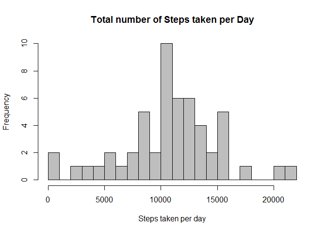
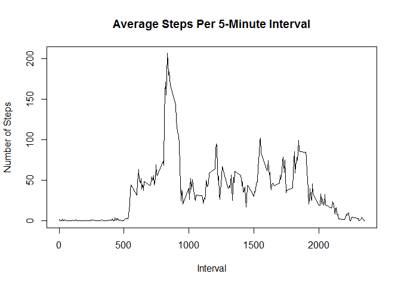
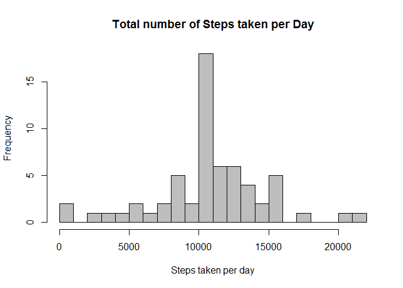
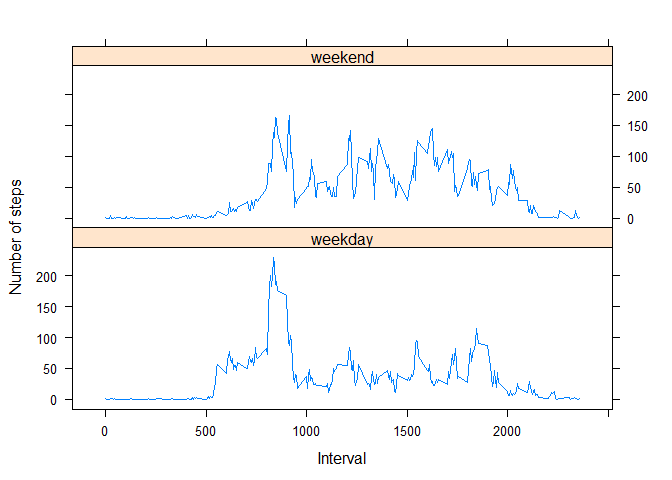

# Reproducible Research: Peer Assessment 1


## Loading and preprocessing the data

```r
#Load the data
data <- read.csv('activity.csv',header = TRUE)
str(data)
```

```
## 'data.frame':	17568 obs. of  3 variables:
##  $ steps   : int  NA NA NA NA NA NA NA NA NA NA ...
##  $ date    : Factor w/ 61 levels "2012-10-01","2012-10-02",..: 1 1 1 1 1 1 1 1 1 1 ...
##  $ interval: int  0 5 10 15 20 25 30 35 40 45 ...
```
## What is mean total number of steps taken per day?

```r
# Calculate total
aggrTotal <- aggregate(steps ~ date, data, sum)

#Show in histogram
hist(aggrTotal$steps,
     breaks=20,
     col = 'grey',
     xlab = 'Steps taken per day', 
     main = 'Total number of Steps taken per Day' )
```

 

```r
#Mean
meanSteps <- round(mean(aggrTotal$steps),2)
meanSteps
```

```
## [1] 10766.19
```

```r
#Median
medianSteps <- median(aggrTotal$steps)
medianSteps
```

```
## [1] 10765
```
The subject took a mean of 10766.19 and a median of 10765 steps per day.

## What is the average daily activity pattern?

```r
#Average number of steps taken, Averaged across all days 
aggrMean <- aggregate(steps~interval,data,mean)
plot(x=aggrMean$interval, 
     y=aggrMean$steps, 
     type="l", 
     main="Average Steps Per 5-Minute Interval", 
     xlab="Interval", 
     ylab="Number of Steps")
```

 

```r
#Max average steps
maxSteps <- aggrMean[which(aggrMean$steps==max(aggrMean$steps)),]
maxSteps
```

```
##     interval    steps
## 104      835 206.1698
```
The maximum average steps per period occur at interval 835, with an average of 206.1698 steps per 5 minutes.

## Imputing missing values

```r
#Missing Values
sum(is.na(data$steps))
```

```
## [1] 2304
```
There are 2,304 total number of missing values.


```r
#Use mean calculated previously
aggrMean$imputedSteps <- floor(aggrMean$steps)

#merge the replacement values
newData <- merge(data,aggrMean[,c('interval','imputedSteps')], by = 'interval')

# Replace the missing values
newData$steps <- ifelse(is.na(newData$steps),
                                 newData$imputedSteps,
                                 newData$steps)
# Remove unnecesary data
newData$imputedSteps <- NULL

#Summarise by day
new_aggrTotal <- aggregate(steps~date,newData,sum)

#Show in histogram
hist(new_aggrTotal$steps,
     breaks=20,
     col = 'grey',
     xlab = 'Steps taken per day', 
     main = 'Total number of Steps taken per Day' )
```

 

```r
#Mean
new_meanSteps <- round(mean(new_aggrTotal$steps),2)
new_meanSteps
```

```
## [1] 10749.77
```

```r
#Median
new_medianSteps <- median(new_aggrTotal$steps)
new_meanSteps
```

```
## [1] 10749.77
```
After imputing the data with the devised strategy, the number of daily steps show a mean of 10749.77 (less than 1 percent of variation from the original mean) and a median of 10641 (around 1 percent of variation from the original median). From these observations, it seems that the impact of imputing missing values on the total number of daily steps is negligible, so probably the original estimates have little bias due to missing values. 

## Are there differences in activity patterns between weekdays and weekends?

```r
# Label dates as weekday/weekend
newData$week_part <- factor(
  ifelse(weekdays(as.Date(newData$date)) %in% c("Monday", "Tuesday", "Wednesday", "Thursday","Friday"),
         'weekday', 'weekend'))
         
#Get new average & plot by weekday/weekend
newAggrMean <- aggregate(steps~week_part+interval,newData,mean)

library("lattice")

xyplot(
    type="l",
    data=newAggrMean,
    steps ~ interval | week_part,
    xlab="Interval",
    ylab="Number of steps",
    layout=c(1,2)
)
```

 
